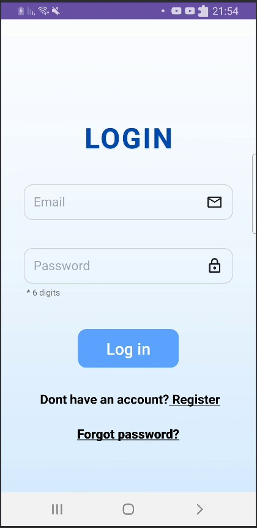
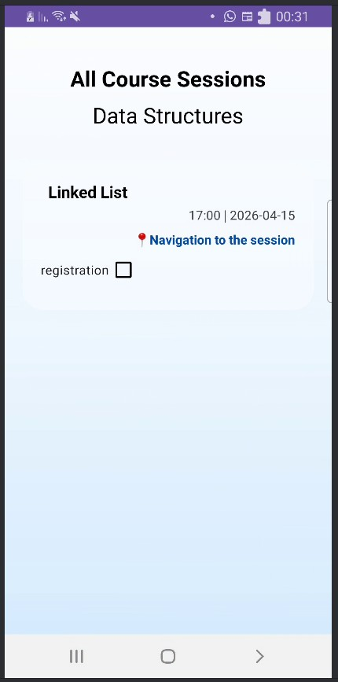
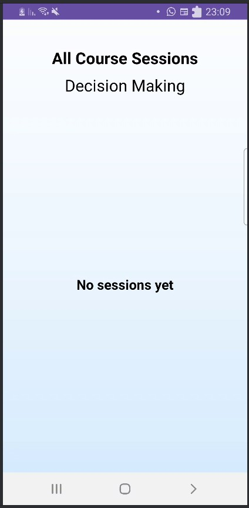
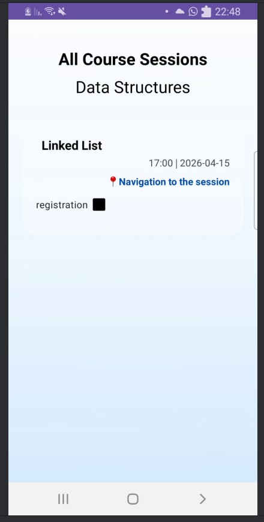
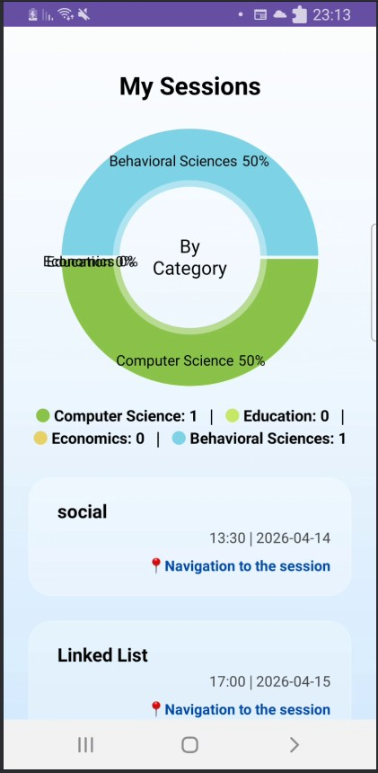
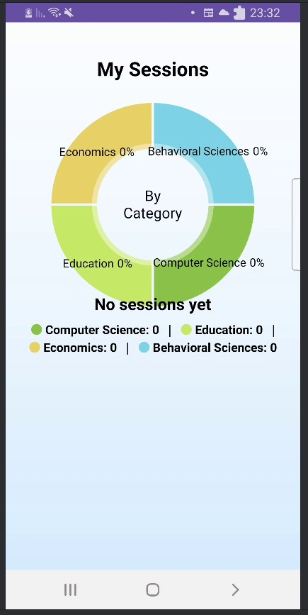
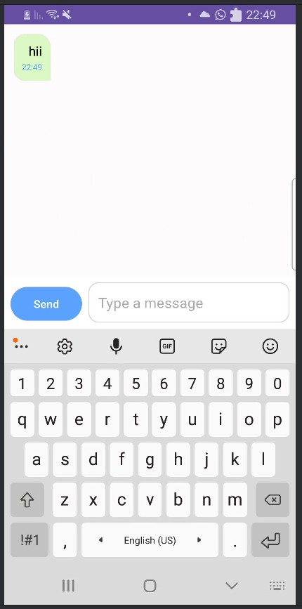
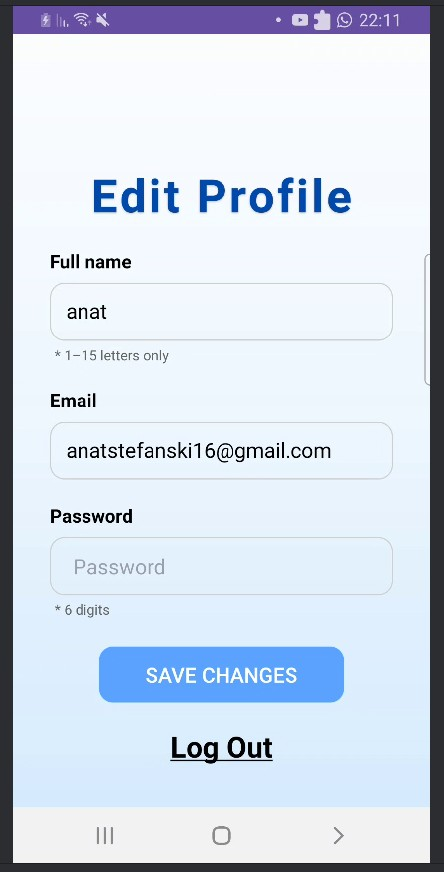

# SmartStudy 

SmartStudy is a mobile application designed to manage academic study sessions.

The app allows students to register for study sessions available in their courses, track their activity, and communicate with other students.
Administrators can create and manage courses and sessions.

## Features

### Student
- Register and login
- Password reset via email
- View available courses
- Search and filter courses
- Register for study sessions
- View "My Sessions" screen
- Visual statistics (sessions by category)
- Chat with other participants registered for the same session 
- Edit profile

### Admin
- Register and login
- Password reset via email
- View available courses
- Create new courses
- Create new study sessions
- Manage course sessions
- No registration to sessions 
- Search and filter courses
- Edit profile

## Screenshots

---

### Student Flow

#### Login
  
Students can log into their account using email and password.

#### Home 
  
Students can view all available courses and search or filter them.

#### Course Details

  
  

  

**When sessions are available:**  
Students can view the available study sessions they can register for.

**When no sessions are available:**  
A message is displayed indicating that there are currently no study sessions available for this course.

#### Session Registration
  
Students can register for available study sessions.

#### My Sessions

  
  

    

**When the student is registered to sessions:**  
Students can view all the study sessions they have registered for.  
In addition, a visual chart is displayed showing the distribution of their sessions by category (in percentages), along with a breakdown of how many sessions belong to each category.

**When the student is not registered to any sessions:**  
No sessions are displayed and the statistics chart remains empty.

#### Chat
  
Students can communicate with other participants in the session.

#### Profile
  
Students can edit their personal information and log out of their account.

---

### Admin Flow

#### Add Course
  
Admins can create new courses.

#### Add Session
  
Admins can create new study sessions inside a course.

#### Course Management
  
Admins can manage course sessions and content.

## Architecture

The application is built using the MVVM architecture:

- View (Activities & XML)
- ViewModel (handles UI logic)
- Repository (Firebase data handling)

This structure ensures clean code, scalability, and maintainability.
